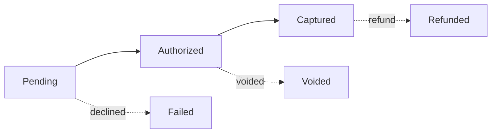
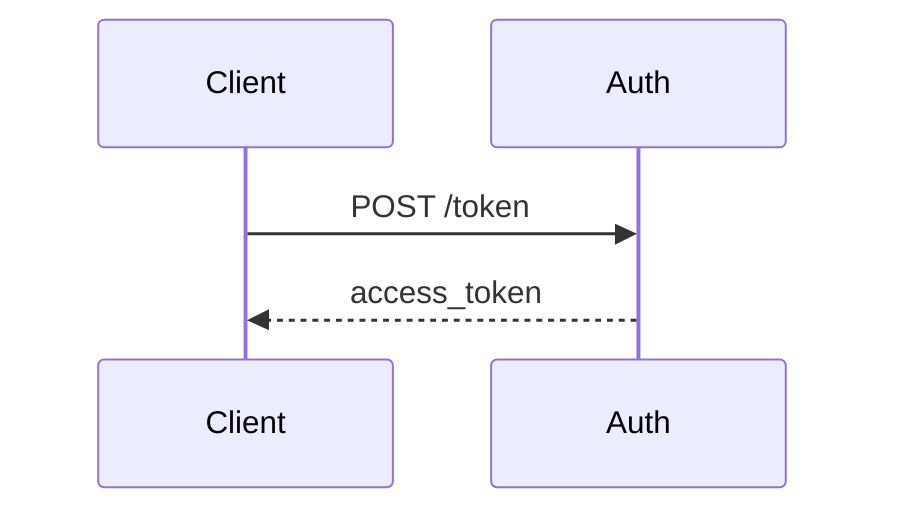
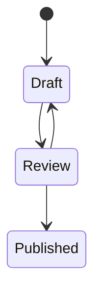
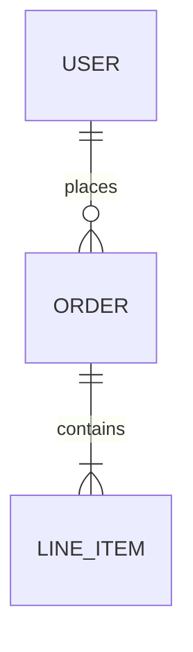

# Markdown formatting

GitBook uses GitHub Flavored Markdown with custom extensions.

## Standard markdown

```markdown
# Heading 1
## Heading 2
### Heading 3

**bold text**
*italic text*
`inline code`

- Bullet list item
- Another item
  - Nested item

1. Numbered list
2. Second item

[Link text](https://example.com)
[Internal link](getting-started.md)
```

## Code blocks

````markdown
```javascript
const foo = 'bar';
console.log(foo);
```
````

**Code blocks with titles:**

````markdown

```javascript
const foo = 'bar';
console.log(foo);
```

````

## Links

```markdown
[External site](https://example.com)
[Page in this space](page.md)
[Page up a level](../folder/page.md)
[Page in a subfolder](subfolder/page.md)
[Email address](mailto:email@example.com)
```

**Cross-space links** — linking to a page in a *different* space needs a different syntax: relative paths never resolve outside the current space. Use the target space's app URL with the page's path appended:

```markdown
[Authentication guide](https://app.gitbook.com/s/Si95BtOt1VRLWjT7A67V/authentication)
[API reference home](https://app.gitbook.com/s/Si95BtOt1VRLWjT7A67V/)
```

The pattern is `https://app.gitbook.com/s/<spaceId>/<pagePath>` — GitBook resolves this to the correct published URL at render time, regardless of custom domain or visibility settings. This is the only correct form for cross-space links; don't use `/spaces/<spaceId>/pages/<pageId>` or a relative path.

### Finding a space ID and page path

To link into an *existing* space you don't have IDs memorized for, pull both from the API (`GITBOOK_TOKEN` required):

```bash
# 1. List spaces in the org to find the target space's ID by title
curl -s -H "Authorization: Bearer $GITBOOK_TOKEN" \
  "https://api.gitbook.com/v1/orgs/$ORG_ID/spaces" | jq '.items[] | {id, title}'

# 2. List that space's pages to find the target page's path
curl -s -H "Authorization: Bearer $GITBOOK_TOKEN" \
  "https://api.gitbook.com/v1/spaces/$SPACE_ID/content/pages" | jq '.pages[] | {title, path}'
```

Each page's `path` field is exactly the string to put after the space ID — no leading slash, no `.md`. Compose the two into `https://app.gitbook.com/s/<spaceId>/<path>`.

If you're scaffolding a brand-new multi-space site and the target space doesn't exist yet (no ID to look up), use the `XSPACE_<KEY>` sentinel workflow instead — see the `configure-site` skill's `references/cross-space-links.md`.

### Moved and renamed pages

When a page is moved or renamed, GitBook automatically creates a redirect from its old path, so existing links — relative or cross-space — keep working without edits. Don't treat a page move as a reason to hunt down and rewrite inbound links. For redirects GitBook doesn't cover automatically (e.g. restructuring done outside the GitBook UI), configure them explicitly via `redirects:` in `.gitbook.yaml` (space-level, see `references/configuration.md`) or the site redirects API (site-level).

## Math/TeX

```markdown
Inline formula: $$E = mc^2$$

Block formula:

$$
E = mc^2
$$
```

## Mermaid diagrams

Any fenced code block with `mermaid` as the language renders as a diagram. Use Mermaid any time you'd otherwise reach for ASCII art or describe a relationship in prose where a picture would help.

````markdown







````

Common types: `flowchart LR`/`TD` (flows, decision trees), `sequenceDiagram` (request/response, multi-actor), `stateDiagram-v2` (formal state machines), `erDiagram` (data models), `gantt` (timelines). Standard Mermaid syntax — no GitBook-specific extensions.

## SVG handling

Two pitfalls affect SVGs referenced via `` or `<picture>`:

* **`currentColor` doesn't resolve in referenced SVGs.** `currentColor` only works when SVG markup is inlined directly into the page. Via `` the SVG renders standalone and `currentColor` falls back to black regardless of theme. For theme-aware icons, either inline the SVG or ship two variants and swap with `<picture>`:

  ```html
  <picture>
    <source srcset=".gitbook/assets/icon-dark.svg" media="(prefers-color-scheme: dark)"/>
    
  </picture>
  ```

* **Keep `xmlns` on standalone SVG files.** Some tools strip `xmlns="http://www.w3.org/2000/svg"` because it's redundant when SVG is inlined into HTML. But when the file is referenced via `` or `<picture>`, a missing `xmlns` causes the browser to parse it as plain XML and render nothing. The xmlns is only safely removable when SVGs are inlined. Keep it by default.
