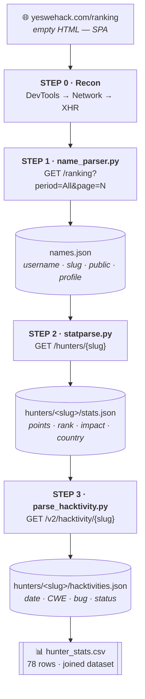

# Scraping the YesWeHack Leaderboard

A four-step pipeline that turns a JavaScript-rendered leaderboard page into a structured dataset of hunters, their stats, and their full bug-disclosure history.

***

## The Pipeline at a Glance



| Step | Script                | Endpoint                | Produces            |
| ---- | --------------------- | ----------------------- | ------------------- |
| 0    | —                     | _reconnaissance_        | endpoint map        |
| 1    | `name_parser.py`      | `/ranking`              | `names.json`        |
| 2    | `statparse.py`        | `/hunters/{slug}`       | `stats.json`        |
| 3    | `parse_hacktivity.py` | `/v2/hacktivity/{slug}` | `hacktivities.json` |

***

## Step 0 · Find the API

The ranking page returns **almost no HTML**. There is a `<div id="app">`, a script bundle, and nothing else. No table rows. The leaderboard is drawn by JavaScript _after_ the page loads — which means the data arrives over a separate request.

### The DevTools procedure



### Open DevTools → Network

_Before_ loading the page.



### Tick Disable cache

Stops a cached response from hiding the request you're hunting for.



### Filter to Fetch/XHR

Drops images, fonts, and analytics noise — leaves only the calls that carry data.



### Click every control

Paginate, open a profile, scroll the feed. Each interaction fires a distinct request.



### Read the request URL, not the response

The URL is where endpoint shape and version prefixes are stated, not inferred.



### Right-click → Copy as cURL, replay it in a terminal


**This is the moment of truth.** If the cURL works outside the browser with no cookie and no token, you have a scriptable, unauthenticated endpoint.




### What the panel revealed

| Action in the browser      | Request that fired                                               |
| -------------------------- | ---------------------------------------------------------------- |
| Load `/ranking`            | `api.yeswehack.com/ranking?period=All&page=1`                    |
| Click page 2               | `api.yeswehack.com/ranking?period=All&page=2`                    |
| Open a hunter profile      | `api.yeswehack.com/hunters/rabhi`                                |
| Scroll the hacktivity feed | `api.yeswehack.com/v2/hacktivity/rabhi?page=1&resultsPerPage=10` |


**Where `/v2/` came from.** It was **read off the wire**, not guessed. The site's own JavaScript built that URL. Note the inconsistency — `/ranking` and `/hunters/` are unversioned, hacktivity is `/v2/`. Version prefixes are a property of the _individual endpoint_, never of the API as a whole.


### The only header needed

```python
headers = {"User-Agent": "Mozilla/5.0"}
```

`requests` defaults to `python-requests/2.x` — the easiest string in the world for a WAF to filter. No cookie, no bearer token, no CSRF header was required.

***

## Step 1 · Enumerate the Leaderboard

**`name_parser.py` → `names.json`**

```
GET https://api.yeswehack.com/ranking?period=All&page=N
```

### The response tells you how many pages exist

```json
{
  "pagination": { "page": 1, "nb_pages": 4, "results_per_page": 25, "nb_results": 100 },
  "items": [ ... ]
}
```

So: **probe page 1 to learn the bound, then loop a known range.**

```python
response = requests.get(f"{base_url}?period=All&page=1", headers=headers)
total_pages = response.json()["pagination"]["nb_pages"]

for page in range(1, total_pages + 1):
    data = requests.get(f"{base_url}?period=All&page={page}", headers=headers).json()
    ...
```

### Each item carries two different identities

```json
{
  "username": "st0rm_",
  "slug": "st0rm-1",
  "hunter_profile": { "public": true },
  "points": 12691,
  "rank": 8
}
```


**`username` ≠ `slug`.** `username` is the display name. `slug` is the URL-safe key — lowercased, punctuation normalised, numerically de-duplicated on collision. `st0rm_` → `st0rm-1` because `st0rm` was already taken.

Writing `username.lower()` would work for most hunters and silently 404 for a handful — the worst failure mode, because it looks like success. **Use the identifier the server gave you. Never re-derive it.**

Every stage of this pipeline keys on `slug`.


### The privacy gate

```python
"profile": f"https://yeswehack.com/hunters/{item['slug']}" if item["hunter_profile"]["public"] else None
```

Not everyone is public — `Rbcafe` sits at **rank 3 with 18,156 points** and `"public": false`. That flag is the platform's own record of what a user consented to expose, so it is honoured rather than probed around. Private hunters keep their ranking row but get `profile: null` and are never fetched again.

### Output — `names.json`

```json
[
  { "username": "rabhi",  "slug": "rabhi",   "public": true,  "profile": "https://yeswehack.com/hunters/rabhi" },
  { "username": "st0rm_", "slug": "st0rm-1", "public": true,  "profile": "https://yeswehack.com/hunters/st0rm-1" },
  { "username": "Rbcafe", "slug": "rbcafe",  "public": false, "profile": null }
]
```

> **\~100 hunters · \~20 private · this file is the worklist for everything downstream.**

***

## Step 2 · Enrich Each Hunter

**`statparse.py` → `hunters/<slug>/stats.json`**

```
GET https://api.yeswehack.com/hunters/{slug}
```

### Skip the private ones first

```python
if hunter["profile"] is None:
    skipped += 1
    continue
```

### The raw response is much wider than what we keep



```json
{
  "username": "SecurityReapers",
  "slug": "securityreapers",
  "public_firstname": "Muhammad",
  "public_lastname": "Usman",
  "points": 7350,
  "nb_reports": 490,
  "rank": 25,
  "impact": "18.42",
  "joined_on": "2023",
  "nationality": "PK",
  "avatar": { "...": "..." },
  "track_records": [ "...", "..." ],
  "kyc_status": "V",
  "gpg_key": null
}
```



```python
return {
    "username": data["username"],
    "slug":     data["slug"],
    "name":     name,
    "joined":   data.get("joined_on"),
    "impact":   float(data.get("impact", 0)),   # ← API sends a STRING
    "reports":  data.get("nb_reports", 0),
    "points":   data.get("points", 0),
    "rank":     data.get("rank", 0),
    "country":  data.get("nationality"),
}
```




**`"impact": "18.42"` is a string.** Strings sort lexicographically — `"9.5" > "18.42"` — which would quietly corrupt every ranking and aggregation downstream. Cast at the ingestion boundary, once, so every consumer can trust the type.


### Fall back gracefully on missing names

```python
first = data.get("public_firstname") or ""
last  = data.get("public_lastname")  or ""
name  = f"{first} {last}".strip() or data["username"]
```

`.get()` covers a missing key, `or ""` covers an explicit `null`, and the final fallback guarantees `name` is never empty. Downstream code never null-checks it.

### Output — `hunters/securityreapers/stats.json`

```json
{
  "username": "SecurityReapers",
  "slug": "securityreapers",
  "name": "Muhammad Usman",
  "joined": "2023",
  "impact": 18.42,
  "reports": 490,
  "points": 7350,
  "rank": 25,
  "country": "PK"
}
```

> **One directory per hunter, named by slug. That directory layout becomes the input to Step 3.**

***

## Step 3 · Pull the Bug History

**`parse_hacktivity.py` → `hunters/<slug>/hacktivities.json`**

```
GET https://api.yeswehack.com/v2/hacktivity/{slug}?page=N&resultsPerPage=50
```

### The worklist is the filesystem, not a file

```python
hunter_dirs = [p for p in sorted(hunters_root.iterdir()) if p.is_dir()]
for hunter_dir in hunter_dirs:
    slug = hunter_dir.name
```

Step 2 only created directories for hunters it successfully fetched, so the set of folders is _already_ exactly the set worth processing. This stage knows nothing about `names.json`, the `public` flag, or the ranking API.


**The filesystem is the interface between stages.** Hand this script a hand-made folder with three slugs in it and it works identically.


### The volume changes the loop

```json
{ "pagination": { "page": 1, "nb_pages": 293, "results_per_page": 50, "nb_results": 14608 } }
```

**14,608 entries for a single hunter.** Over a crawl that long, `nb_pages` can genuinely shift — someone discloses a new bug mid-scrape. So instead of a fixed `range`, re-read the bound from _every_ response:

```python
while True:
    data = session.get(url).json()
    ...
    if page >= data["pagination"]["nb_pages"]:
        break
    page += 1
```


The browser requested `resultsPerPage=10` because that is what fits the UI widget. Nothing forces a scraper to be that polite — **50 cuts the round trips by 5×.** Observed query parameters are a starting point, not a contract.


### The raw entry

```json
{
  "date": "2026-07-21",
  "status": "resolved",
  "bug_type": {
    "name": "Cross-site Scripting (XSS) - Reflected (CWE-79)",
    "slug": "cross-site-scripting-xss-reflected-cwe-79"
  }
}
```

### Split the CWE off the bug name

The CWE is welded onto the end of a single string. Grouping on it raw would treat reflected and stored XSS as unrelated categories despite both being CWE-79.

```python
_CWE_RE = re.compile(r"\s*\((CWE-\d+)\)\s*$", re.IGNORECASE)

def _split_bug_type(raw):
    m = _CWE_RE.search(raw)
    if not m:
        return raw, None
    return raw[:m.start()].strip(), m.group(1).upper()
```


**The `$` anchor is doing the real work.** Bug names are full of parentheses — `(XSS)`, `(IDOR)`, `(CSRF)`. Anchoring to end-of-string states something honest about the data: _the CWE tag is a suffix, and I will only match it as a suffix._ Everything before `m.start()` is the name, whatever it contains.

`return raw, None` when there is no match — a nullable field is a truthful representation of "this entry has no CWE." Inventing `"CWE-0"` would fabricate a category.


### Keep both the parsed and the raw form

```python
@dataclass
class Entry:
    date: str            # normalised ISO
    date_raw: str        # exactly as returned
    bug_name: str        # "Cross-site Scripting (XSS) - Reflected"
    cwe: str | None      # "CWE-79"
    bug_type_raw: str    # "Cross-site Scripting (XSS) - Reflected (CWE-79)"
    status: str          # "Resolved"
```


**Preserve the raw input.** When the parser turns out to be wrong about some edge case, you reparse 14,608 stored records instead of re-crawling them. Parsing is cheap to redo; fetching is not.


Status is normalised with `.capitalize()` — the API returns `"resolved"` / `"new"` / `"closed"` lowercase, and fixing casing at write time means no `.lower()` scattered across every consumer.

### Output — `hunters/rabhi/hacktivities.json`

```json
[
  {
    "date": "2026-07-24",
    "date_raw": "2026-07-24",
    "bug_name": "Insecure Direct Object Reference (IDOR)",
    "cwe": "CWE-639",
    "bug_type_raw": "Insecure Direct Object Reference (IDOR) (CWE-639)",
    "status": "Resolved"
  },
  {
    "date": "2026-07-23",
    "date_raw": "2026-07-23",
    "bug_name": "HTML Injection",
    "cwe": "CWE-79",
    "bug_type_raw": "HTML Injection (CWE-79)",
    "status": "Resolved"
  }
]
```

***

## The Result

```
names.json                         ← who exists · who is public
hunters/
├── rabhi/
│   ├── stats.json                 ← points · rank · impact · country
│   └── hacktivities.json          ← 14,608 entries
├── securityreapers/
│   ├── stats.json
│   └── hacktivities.json
└── ...
hunter_stats.csv                   ← 78 rows · flattened join of every stats.json
```

```
username,joined,impact,reports,points,rank,country
SecurityReapers,2023,18.42,490,7350,25,PK
```


**`slug` is the join key threading all four steps.** It comes out of `/ranking`, becomes a directory name, and is the path parameter for both follow-up endpoints. Picking a stable key early is what lets three independently-runnable scripts compose into one dataset.


***

## The Reusable Method

Strip away YesWeHack and this is the procedure:



### Empty HTML source?

The data is arriving over a separate request. Find it.



### Interact with every control

Each click reveals a parameter name.



### Read the URL before the response

Version prefixes are stated there, never inferred.



### Copy as cURL and replay

Learn what auth is actually required.



### Self-describing pagination?

Use the total to bound your loop.



### Use server-supplied identifiers verbatim

`slug`, never `username.lower()`.



### Honour visibility flags

`public: false` is a consent signal, not an obstacle.



### Normalise types and store raw beside parsed

Do it at the boundary.



### Let the filesystem be the interface between stages



> The scraping is the easy part. The reconnaissance — finding an undocumented `/v2/` namespace by _watching a browser do its job_ — is the part worth practising.
