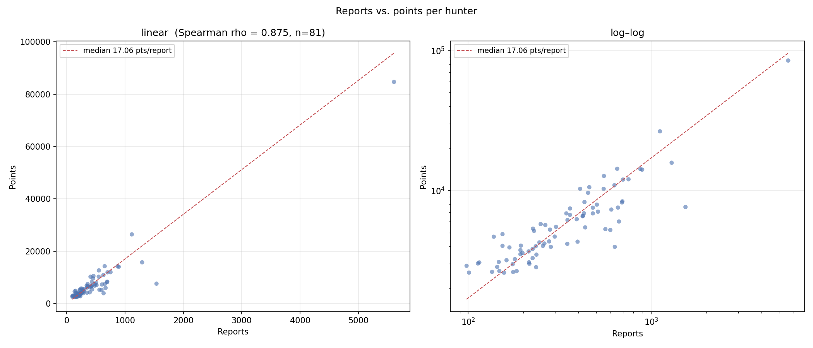

# Reports vs. Points Correlation Analysis

## Overview

This page documents the end-to-end analysis that investigates whether the number of accepted bug reports submitted by a hunter predicts the total number of points they earn on the platform.

The analysis covers **81 public hunter profiles** drawn from a dataset of 100 ranked hunters. The remaining 19 had undisclosed public profiles and were excluded (see [Limitations](reports-vs.-points-correlation-analysis.md#limitations-and-future-research)).

***

## Research Question

> **Is there a statistically significant monotonic relationship between the number of accepted reports a hunter submits and the total points they earn?**

***

## Hypotheses

| Symbol | Statement                                                                         |
| ------ | --------------------------------------------------------------------------------- |
| **H₀** | There is no relationship between accepted reports and total points earned (ρ = 0) |
| **Hₐ** | There is a relationship between accepted reports and total points earned (ρ ≠ 0)  |

Significance level: **α = 0.05**

***

## Data Pipeline

Each hunter's data is stored in a per-folder `stats.json` file and loaded into a single pandas DataFrame before analysis.

The report count that will be used in this analysis is from `stats.json`, not `hacktivities.json`

**Directory layout**

```
root/
├── Codes/
│   ├── reports_to_points.py
│   └── hunters/
│       └── <hunter_name>/
│           └── stats.json
└── Outputs/
    ├── reports_vs_points.png
    └── hunter_points_reports.csv
```

**Example `stats.json` record**

```json
{
  "username": "Blaklis",
  "name": "Blaklis",
  "joined": "2016",
  "impact": 24.18,
  "reports": 229,
  "points": 5140,
  "rank": 50,
  "country": "FR"
}
```

***

## Assumption Checks

Before selecting a statistical test, the following assumptions were verified.



### Independence of observations

Each row represents a unique hunter. One hunter's report count and points are structurally unrelated to any other hunter's, so the independence assumption is satisfied.



### Normality

The Shapiro-Wilk test was applied to both variables. Both returned W values below 0.40 with p < .001, indicating a strong departure from normality. Both distributions exhibit heavy right skew (skewness ≈ 6.81 for reports, 6.95 for points): a small number of high-volume hunters pull the mean well above the median.

```
Reports  — mean: 452.62,  median: 297.00,  max: 5,610
Points   — mean: 7,159.04, median: 5,222.00, max: 84,713
```



### Outliers

Extreme values are present in both variables. The maximum report count (5,610, from a single hunter) is roughly **12× the mean**, and the maximum points value (84,713, the same hunter) is also roughly **12× the mean**. These values would substantially inflate a Pearson correlation.



### Monotonicity

Exploratory scatter plots (linear and log–log, see [Visualisations](reports-vs.-points-correlation-analysis.md#visualisations)) show a consistently increasing, monotonic relationship between reports and points rather than a straight-line one. This is further evidenced by the divergence between Spearman ρ and Pearson r (see [Results](reports-vs.-points-correlation-analysis.md#results)).



***

## Choice of Statistical Test

**Spearman's rank correlation** was selected for the following reasons:

| Condition                                       | Status                             |
| ----------------------------------------------- | ---------------------------------- |
| Monotonic (not necessarily linear) relationship | ✓ Confirmed by scatter             |
| Heavy right skew in both variables              | ✓ Skewness ≈ 6.8–7.0               |
| Outliers present                                | ✓ Max ≈ 12× mean                   |
| Normality required by Pearson                   | ✗ Violated (Shapiro-Wilk p < .001) |

Spearman correlates the **ranks** of the values rather than the values themselves. This makes it robust to the heavy right tail that leaderboard fields tend to have and detects any monotone relationship rather than only a linear one.

***

## Descriptive Statistics

The table below summarises central tendency, spread, and distributional shape for both variables across the **81 public hunters** in the analysis.

| Statistic          | Reports    | Points       |
| ------------------ | ---------- | ------------ |
| N                  | 81         | 81           |
| Missing            | 0          | 0            |
| Mean               | 452.62     | 7,159.04     |
| Median             | 297.00     | 5,222.00     |
| Standard deviation | 639.47     | 9,557.71     |
| Variance           | 408,919.01 | 91,349,866.0 |
| Minimum            | 98         | 2,586        |
| Maximum            | 5,610      | 84,713       |
| Skewness           | 6.81       | 6.95         |
| Shapiro-Wilk W     | 0.393      | 0.367        |
| Shapiro-Wilk p     | < .001     | < .001       |

***

## Visualisation

The script produces a side-by-side scatter plot with both a linear and a log–log axis.

<figure><figcaption><p>Linear panel (left) shows the raw cluster of hunters with Spearman ρ in the title; log–log panel (right) compresses the range so the full 81-hunter population is readable.</p></figcaption></figure>

***

## Results

Spearman's rank correlation was computed for three variable pairs. The points–rank pair is discussed separately because it is a structural relationship, not a behavioural finding.

<table><thead><tr><th>Variables</th><th width="62">n</th><th width="113">Spearman ρ</th><th width="132">p-value</th><th>Interpretation</th></tr></thead><tbody><tr><td>Reports vs Points</td><td>81</td><td>+0.875</td><td>1.33e-26</td><td>Very strong positive</td></tr><tr><td>Reports vs Rank</td><td>81</td><td>−0.875</td><td>1.33e-26</td><td>Very strong negative</td></tr></tbody></table>



A very strong positive monotonic correlation was found between accepted reports and total points earned. Because p < α = 0.05, we **reject the null hypothesis** and conclude that **hunters with more accepted reports consistently earn more points**.



The strong negative correlation between reports and rank remains consistent since **a** **lower rank number denotes a higher standing.** Hence, more reports translate to a better rank. This pair mirrors the reports–points finding and adds no independent information.



### Checking for outlier sensitivity

The most extreme hunter (5,610 reports, 84,713 points, username rabhi) could plausibly be inflating the correlation.

| Sample                      | n  | Spearman ρ | p-value  |
| --------------------------- | -- | ---------- | -------- |
| Full sample                 | 81 | +0.875     | 1.33e-26 |
| Most extreme hunter removed | 80 | +0.870     | 1.08e-25 |

The coefficient barely moves from 0.875 to 0.870.

***

## Limitations and Future Research

### Hunter tenure

A hunter active on the platform for longer will naturally accumulate more reports and points. The observed correlation may partly reflect differences in account age rather than a direct link between activity and reward. Future work could control for tenure by including account creation date as a covariate (`joined` is already present in `stats.json`), or by analysing reports-per-month and points-per-month instead of raw totals. No partial correlation or tenure-adjusted analysis has been run yet — this remains an open item, not a completed check.

### Undisclosed profiles

Of the 100 ranked hunters, **19 had undisclosed public profiles** and were excluded (down from 22 in the previous version of this page, after 3 additional public profiles were located). If disclosure is systematically related to performance level — for example, if top-ranked hunters are more or less likely to make their profiles public — the 81-hunter sample may not be representative of the full population. Future work could examine whether disclosed and undisclosed hunters differ in activity level, and whether the correlation holds across the full 100.

### Report severity

The dataset records accepted report counts but not severity or reward-per-report. Two hunters with equal report counts can have very different point totals depending on whether they filed critical versus low-severity reports. The `points_per_report` column in the CSV export approximates this, but a full severity breakdown would require the per-report `hacktivities.json` data already collected alongside each `stats.json`.

***

## Conclusion

Spearman's rank correlation analysis found a **very strong, statistically significant positive monotonic relationship** between accepted reports and total points earned among the 81 public hunters analysed (ρ = +0.875, p = 1.33e-26). The null hypothesis of no relationship was rejected at α = 0.05.

The log–log scatter and the divergence between ρ and Pearson r both indicate that the relationship is **monotone but not linear**: points grow disproportionately faster than reports at the high end of the leaderboard, consistent with high-volume hunters also tending to file higher-severity reports or accumulate tenure-based bonuses — though this specific explanation has not itself been tested and should be read as a plausible account, not a demonstrated one. This non-linearity does not weaken the main finding — Spearman is designed to capture it — but it means a simple linear model would underestimate the reward for the most active hunters. The sensitivity check above confirms this conclusion is not an artifact of the single most extreme hunter: removing them changes ρ by only 0.005.

The confounds noted above (tenure, disclosure bias, severity mix) should be kept in mind when interpreting the direction and magnitude of this association.

***
