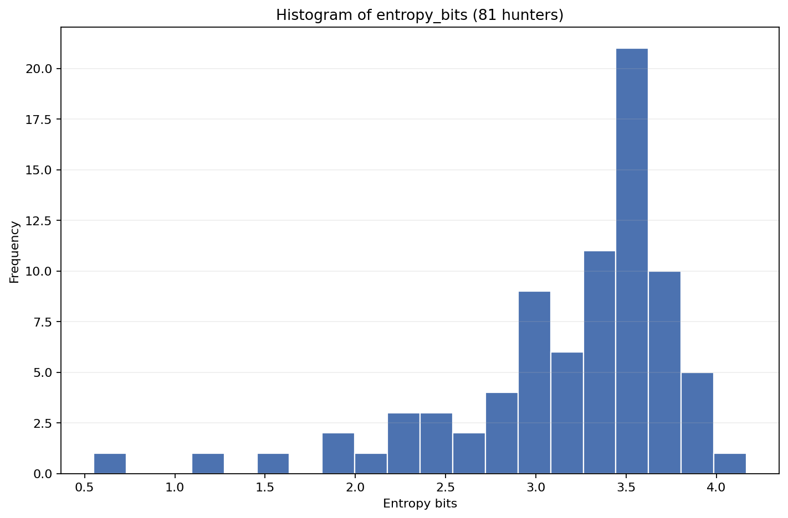

# Spearman Correlation Analysis: Rank and Shannon Entropy

## Research Question

Does vulnerability specialization correlate with hunter rank?

***

## Definitions

**Vulnerability specialization** is defined as the concentration of a hunter's reporting effort across vulnerability classes. Hunters whose reports are disproportionately concentrated within one or a few vulnerability classes exhibit greater specialization, whereas hunters whose reports are distributed more evenly across multiple vulnerability classes exhibit greater generalization.

**Generalization** refers to the distribution of reporting effort across a wider variety of vulnerability classes, resulting in higher Shannon entropy values.

## How Shannon Entropy Was Constructed

Shannon entropy is a measure of the uncertainty or diversity within a probability distribution. In the context of hunter specialization, it is used to quantify the concentration of a hunter's reports across vulnerability classes.

<table><thead><tr><th width="183">Role</th><th width="138">Variable</th><th>Description</th></tr></thead><tbody><tr><td>Dependent (DV)</td><td><code>rank</code></td><td>The hunter's position on the leaderboard</td></tr><tr><td>Independent (IV)</td><td><code>entropy_bits</code></td><td>Shannon entropy of the hunter's report distribution</td></tr></tbody></table>



### Read every "New" record

Reads every hacktivity record whose `status` is `"New"`.



### Group by vulnerability category

Records are grouped per `cwe` identifier, producing a count per category



### Compute Shannon entropy in bits

Using the standard formula:

$$H = -\sum_{i} p_i \log_2 p_i$$

where $$p_i$$ is the proportion of reports that fall into category $$i$$. The implementation in `shannon.py` is:

```python
def shannon_entropy(counts: Counter) -> float:
    total = sum(counts.values())
    if total == 0:
        return 0.0
    h = -sum(
        (c / total) * math.log2(c / total)
        for c in counts.values()
        if c > 0
    )
    return h if h > 0 else 0.0
```



### Choosing `cwe` over `bug_name`

* `bug names` falling under the same CWE, such as "Reflected XSS", "Stored XSS" and "DOM XSS" which are all under CWE-79 (Cross-site Scripting), having three distinct values would inflate a hunter's entropy score even when the majority of the hunter's reports are concentrated in a single vulnerability class.
* `cwe` provides a fixed, program-independent category set, so entropy computed over it measures breadth across vulnerability classes rather than breadth across report labels which is what specialization refers to in the Definitions above.


- **Low entropy (close to 0 bits):** The hunter concentrates almost all reports in one or two categories. Their portfolio is narrow and specialized.
- **High entropy:** Reports are spread across many categories with roughly equal frequency. The hunter is broadly diversified.


Before conducting statistical tests, an assumption check was made to ensure that the data is fit for testing.

As seen in the histogram below, the entropy bits do not exhibit a normal distribution and are heavily skewed to the left.

A shap

<figure><figcaption></figcaption></figure>


***

## Statistical Methods

### Shannon Entropy

For each hunter, Shannon entropy (in bits) is calculated from the distribution of Common Weakness Enumeration (CWE) categories in their accepted reports. Lower entropy values indicate greater concentration of reporting effort (greater specialization) and higher entropy values indicate greater diversity of reporting effort (greater generalization).

### Spearman Correlation

Spearman's rank correlation coefficient is used to assess the monotonic relationship between Shannon entropy and hunter rank. Spearman's correlation is selected because hunter rank is an ordinal variable and exploratory data analysis indicated that the variables are non-normally distributed and contain outliers.

***

## Variables

| Role             | Variable       | Description                                                  |
| ---------------- | -------------- | ------------------------------------------------------------ |
| Independent (IV) | `rank`         | The hunter's position on the leaderboard (lower = better)    |
| Dependent (DV)   | `entropy_bits` | Shannon entropy of the hunter's report distribution, in bits |

### What the entropy value means for each hunter

A hunter's `entropy_bits` score reflects how evenly their accepted reports are spread across vulnerability categories:


* **Low entropy (close to 0 bits):** The hunter concentrates almost all reports in one or two categories. Their portfolio is narrow and specialized.
* **High entropy:** Reports are spread across many categories with roughly equal frequency. The hunter is broadly diversified.


For example, `rabhi` (rank 1, 5 610 reports, `entropy_bits = 2.7254`) is moderately concentrated relative to the theoretical maximum for 43 distinct CWE categories, while `Brumens` (rank 100, 125 reports, `entropy_bits = 3.8087` across 24 categories) shows notably more uniform spread within their smaller portfolio.

***

## Assumption Checks

Spearman's rank correlation was chosen over Pearson's in the Statistical Methods section above. To confirm that choice rather than assert it, a preliminary linear regression of `entropy_bits` on `rank` was fit purely to test the assumptions Pearson/OLS would require.


The regression below is diagnostic only. It is used to test assumptions and is not reported as a finding of this analysis.


### Linearity and Monotonicity

| Statistic                        | Value               |
| -------------------------------- | ------------------- |
| Pearson r (rank, entropy\_bits)  | 0.0445 (p = 0.6931) |
| Spearman ρ (rank, entropy\_bits) | 0.0147 (p = 0.8966) |

Both coefficients are negligible; neither test suggests a relationship that the other form would have caught but missed.

### Normality

Based on the histogram below, which is heavily skewed to the left, `entropy_bits` does not observe a normal distribution. A Shapiro-Wilk test confirms this: `entropy_bits` itself rejects normality (W = 0.8548, p = 2.06 × 10⁻⁷), as does the same test on the preliminary regression's residuals (W = 0.8559, p = 2.24 × 10⁻⁷, skew = −1.62, kurtosis = 6.11).

### Outliers

Four of 81 hunters (`xavoppa`, `mheranco`, `0xsnpaii`, `ghazidz00`) fall above the 4/n Cook's distance threshold in the preliminary regression, driven by unusually low or high entropy relative to their rank (for example, `xavoppa` has `entropy_bits = 0.5501`, well below the dataset's typical range).

### Homoscedasticity

A Breusch-Pagan test on the preliminary regression's residuals does not reject constant variance (LM statistic = 0.7057, p = 0.4009). Unlike the [Reports vs. Points regression](reports-vs.-points-correlation-analysis.md), homoscedasticity is not a problem here on its own — but it does not rescue Pearson given the normality and outlier violations above.

### Choice of Statistical Test

| Assumption required by Pearson | Status                                                       |
| ------------------------------ | ------------------------------------------------------------ |
| Normality of `entropy_bits`    | ✗ Violated (Shapiro-Wilk p = 2.06 × 10⁻⁷)                    |
| No influential outliers        | ✗ Violated (4 of 81 above the Cook's distance 4/n threshold) |
| Homoscedasticity               | ✓ Not violated (Breusch-Pagan p = 0.4009)                    |


Two of the three testable Pearson assumptions are violated. Spearman's rank correlation is used instead, consistent with the Statistical Methods section above. The `entropy_bits ~ rank` regression above exists only to demonstrate this; the correlation itself is negligible regardless of which test is used.


***

## Hypotheses


{% column width="50%" %}
### Null Hypothesis — $H\_0$

$$H_0: \rho = 0$$

There is no association between a hunter's leaderboard rank and their degree of specialization or diversification. Any observed correlation is attributable to chance.


{% column width="50%" %}
### Alternative Hypothesis — $H\_a$

$$H_a: \rho \neq 0$$

Specialization (or diversification) has an effect on leaderboard rank. Hunters who concentrate on fewer vulnerability types perform systematically differently from those who spread their reports across many types.



***

## Statistical Test

### Alpha Level

The significance threshold is set at:

$$\alpha = 0.05$$

A result is considered statistically significant only if the two-tailed p-value falls below this threshold.

### Spearman Rank Correlation

Spearman's $\rho$ was chosen because:

* Both variables (`rank` and `entropy_bits`) are ordinal or continuous but not assumed to be normally distributed.
* The relationship between rank and entropy may be monotonic but non-linear.
* Spearman is robust to outliers, which is important given the wide spread of report volumes in the dataset.

The correlation was computed in `spearman_entropy.py` using `scipy.stats.spearmanr` on the 81 hunters present in `hunter_entropy.csv`:

```python
from scipy.stats import spearmanr
rho, pvalue = spearmanr(df["rank"], df["entropy_bits"])
```

### Results

| Statistic            | Value  |
| -------------------- | ------ |
| Spearman's $\rho$    | 0.0147 |
| p-value (two-tailed) | 0.8966 |
| N                    | 81     |

### Interpretation

The correlation coefficient of $\rho = 0.0147$ is negligible in magnitude and close to zero. The (weakly) positive sign indicates that higher-ranked hunters (lower rank number) have a very slight tendency toward lower entropy — i.e., marginally more specialized — but the effect is far too small to be meaningful.


The p-value of $0.8966$ is far above $\alpha = 0.05$. The null hypothesis cannot be rejected. There is **no statistically significant association** between a hunter's leaderboard rank and their Shannon entropy (diversification) across vulnerability categories, measured by CWE, in this dataset.

