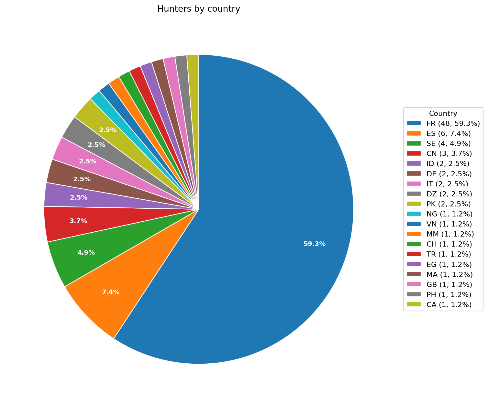
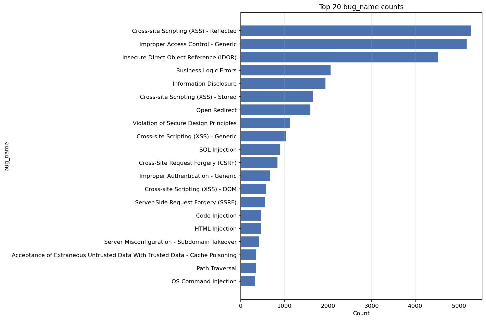
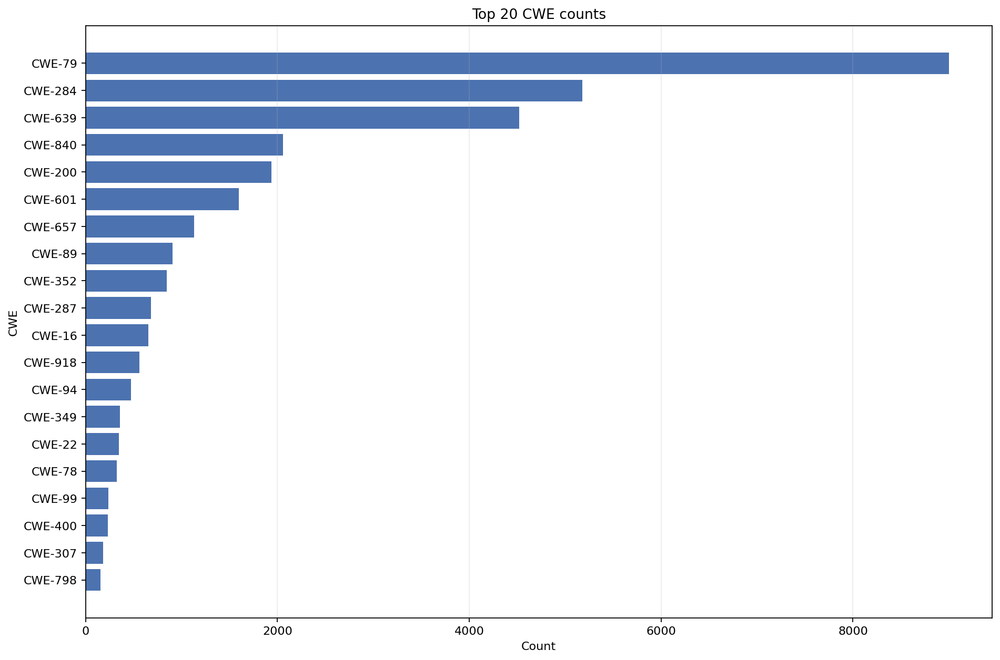
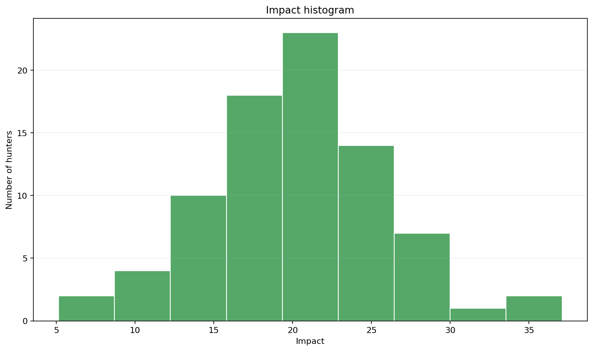
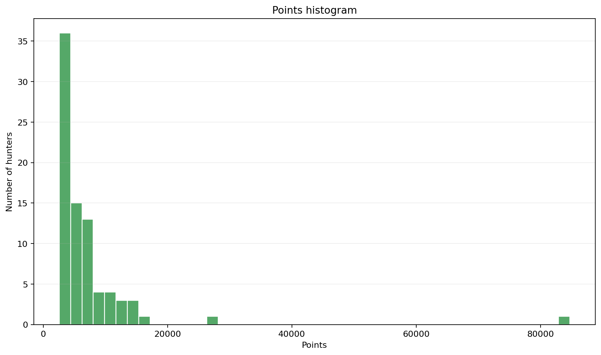
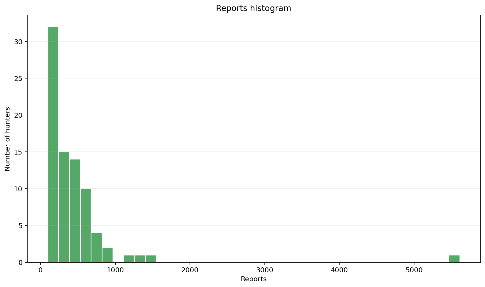

# Statistical Inference EDA Report

This document summarizes the exploratory data analysis performed before any statistical testing. The goal is to describe the shape, spread, and consistency of the dataset so the later inference step is grounded in the data distribution rather than assumptions.

## Data Sources

* hunter\_stats.csv: `username, joined, impact, reports, points, rank, country`
* hunter\_hacktivity\_report\_counts.csv: `hunter, hacktivity_report_count`
* Stats.txt for the top bug-name and CWE frequency tables

```
Processed 81 hunters //Stats.txt
New reports with bug_name: 33649
New reports with CWE:      33649

=== Bug Types (status = new) ===
 5267  Cross-site Scripting (XSS) - Reflected
 5176  Improper Access Control - Generic
 4519  Insecure Direct Object Reference (IDOR)
 2057  Business Logic Errors
 1940  Information Disclosure
 
=== CWEs (status = new) ===
 9000  CWE-79
 5176  CWE-284
 4519  CWE-639
 2057  CWE-840
```

## Country Distribution

France dominates the public hunter set, accounting for 48 of 81 hunters, or about 59.3%. The next largest groups are Spain with 6 hunters, Sweden with 4, and China with 3. Most remaining countries contribute only one or two hunters each.

<figure><figcaption><p>Hunter distribution by country</p></figcaption></figure>

## Bug Name and CWE Frequency

### Top 20 Bug Names

<figure><figcaption><p>Top 20 Bug Names</p></figcaption></figure>

### Top 20 CWEs

<figure><figcaption><p>Top 20 CWE</p></figcaption></figure>

The bug-name distribution is concentrated in a small number of categories, led by Cross-site Scripting (XSS) - Reflected (5 267 reports), Improper Access Control - Generic (5 176), and Insecure Direct Object Reference / IDOR (4 519). The CWE distribution shows a similar pattern, with CWE-79 (9 000), CWE-284 (5 176), CWE-639 (4 519), and CWE-840 (2 057) forming a heavy head. The full run covered 33 649 new reports with bug names and the same count with CWEs.


**Interpretation.** The dataset is not evenly spread across vulnerability classes. It is dominated by a few highly recurring patterns, which suggests that later statistical tests should be careful about assuming normality or equal representation across categories.


## Numeric Hunter Attributes

The following summaries describe the main numeric fields in hunter\_stats.csv.

### Summary Table

The histogram bin choice for each variable uses the Freedman-Diaconis rule, which adapts to spread and sample size.

| Field   |      Mean |   Std Dev | Minimum                        | Maximum                     |   Skew |
| ------- | --------: | --------: | ------------------------------ | --------------------------- | -----: |
| impact  |   20.0723 |    5.7483 | 5.1400 by Xiety, rank 21       | 37.1000 by zc, rank 51      | 0.1742 |
| reports |  452.6173 |  639.4678 | 98.0000 by Mekky, rank 90      | 5610.0000 by rabhi, rank 1  | 6.8057 |
| points  | 7159.0370 | 9557.7124 | 2586.0000 by Brumens, rank 100 | 84713.0000 by rabhi, rank 1 | 6.9547 |

<figure><figcaption><p>Impact Distribution</p></figcaption></figure>

<figure><figcaption><p>Points Distribution</p></figcaption></figure>

<figure><figcaption><p>Reports Distribution</p></figcaption></figure>


**Interpretation.** Impact is close to symmetric, with very low skew, so it looks much more stable than the other two measures. Reports and points are both strongly right-skewed, which means a few hunters sit far above the rest and pull the mean upward. The large standard deviations and wide IQRs confirm that the spread is substantial, especially for reports and points.

Because reports and points are so skewed, any later statistical testing that assumes normality should be treated cautiously. A median-based or nonparametric check may be more robust if the analysis is sensitive to outliers.


## Report Count Reconciliation

Worst 20 hunters text summary

The script compared the official report counts from hunter\_stats.csv against the counts from hunter\_hacktivity\_report\_counts.csv.

Key result: all 81 hunters matched by name, but the counts still disagree for many hunters. The official report count is generally higher than the hacktivity count. The largest absolute mismatches are:

* Icare: 701 official vs 432 hacktivity, error 269
* wlayzz: 429 official vs 225 hacktivity, error 204
* truff: 392 official vs 199 hacktivity, error 193
* Edra: 630 official vs 478 hacktivity, error 152
* kuromatae: 344 official vs 198 hacktivity, error 146


**Interpretation.** The two sources are not interchangeable. The hacktivity-based report totals systematically undercount the official hunter stats for many hunters, so the mismatch should be considered a data quality issue before doing any inference based on report totals.


## Overall Reading of the Dataset

The dataset is small, geographically concentrated, and heavily dominated by a handful of hunter names and vulnerability categories. Impact is relatively well-behaved, but reports and points are highly skewed and likely contain influential high-end outliers. The count mismatch between the two report sources is large enough to matter analytically, so the official `reports` field should be treated as the more reliable reference for later testing.

In short: this is not a cleanly normal, evenly distributed dataset. It is a sparse, long-tailed, and partially inconsistent dataset, which makes descriptive EDA essential before any hypothesis test or model fitting.
